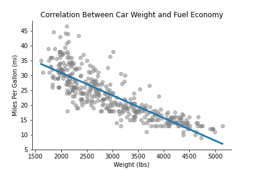
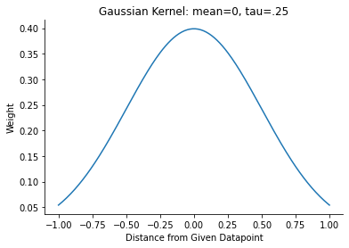
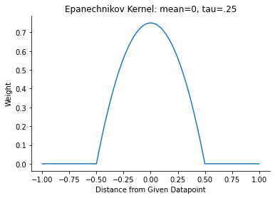
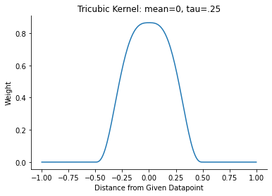
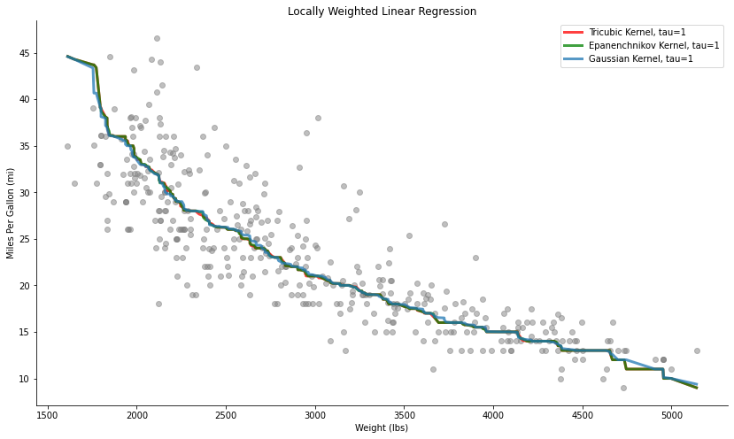
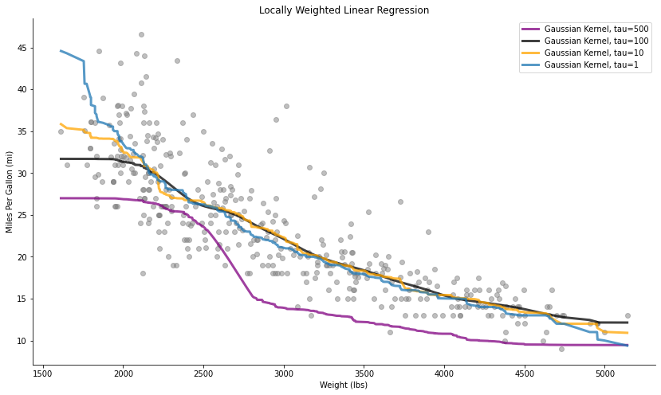

# Locally Weighted Regression
### DATA 441 Project #1 - Sam Joyner

### Linear Regression

Linear regression is a technique used to predict an output value given at least one input. Mathematically, this can be represented as:

<p align="center">
  <b>y</b> = <b>X&beta;</b>+<b>&epsilon;</b>
</p>

Where <b>y</b> is the vector of outputs, with <b>x</b> as the vector of inputs, <b>&beta;</b> as the weights vector, and <b>&epsilon;</b> as the random error for each prediction. An import assumption is that the error term is normally distributed with a mean of zero and standard deviation of one. With this assumption in hand, we can solve for <b>&beta;</b>: 

<p align="center">
  <b>X<sup>T</sup>y</b> = <b>X<sup>T</sup>X&beta;</b>+<b>X<sup>T</sup>&epsilon;</b> = <b>X<sup>T</sup>X&beta;</b>
  <br>
  <b>(X<sup>T</sup>X)<sup>-1</sup>X<sup>T</sup>y</b> = <b>&beta;</b>
</p>

Using this we can also plug <b>&beta;</b> back in to get a explicit formula for <b>y</b>, our predictions. As the name suggests, this technique works great for linear datasets. The following example shows the relationship between car weight and mileage, and the line in blue is a standard linear regression, done with the technqiue described above, that attempts to predict miles per gallon based off weight.

<p align="center">

</p>

Linear regression does an decent job, but there is certainly room to improve this model, particularly with lower weights where the trend appears more quadratic rather than linear.

### Adding Weights to the Regression Equation

To fit a better model to this data, we can employ <b>Locally Weighted Linear Regression (LOWESS)</b>, which is similar to the technique above, but allows for curvature by performing linear regression over very small portions of the data that collectively create a curved, better fit model. To do this, we now use a matrix of weights (more on this later) that determines how important values will be to the given prediction. To represent this mathematically, we begin with the same regression equation as before and then multiply by <b>W</b>, which is a matrix containing weights along the diagonal and zeros everywhere else: 

<p align="center">
  <b>Wy</b> = <b>WX&beta;</b>+<b>W&epsilon;</b>
  <br>
  <b>X<sup>T</sup>Wy</b> = <b>X<sup>T</sup>WX&beta;</b>+<b>X<sup>T</sup>&epsilon;</b> = <b>X<sup>T</sup>WX&beta;</b>
  <br>
  <b>(X<sup>T</sup>WX)<sup>-1</sup>X<sup>T</sup>Wy</b> = <b>&beta;</b>
</p>

The obvious question becomes how to determine the proper weights, and this is done through kernels that determine the weights and a hyperparameter that specifies the width of the kernel. All of the points that have a nonzero weight make up a neighborhood, and from each neighborhood a linear regression is made, and all of these collectively make up the nonlinear model. Examples of kernels include the Gaussian, Epanechnikov, and Tricubic kernels, seen below.

<p>
  <div class='row'>
      
      
      
  </div>
</p>

What locally weighted linear regression does is iterate over the data and for every point it applies the weights to nearby kernels, according to the choosen kernel and width, and creates the neighborhood that creates a small linear regression that combines with the others to create a nonlinear model.

### Applying Weighted Linear Regression

Having explained the math and concepts behind locally weighted linear regression, we can now begin to develop code to create models using this approach. The code below shows how to run these sets of small linear regressions to make the overall model using the weighted approach.

```Python
def locally_weighted_linear_regression(x, y, kern='Gaussian', tau=0.05):
    # Get input length and initialize output
    n = len(x)
    y_out = np.zeros(n)

    # Call the given kernel, return if not one of these three options
    # w is the weights matrix based on each points distance from
    #   the current point x[i]
    if kern == 'Gaussian':
      w = np.array([Gaussian((x-x[i])/(2*tau)) for i in range(n)])   
    elif kern == 'Epanechnikov':
      w = np.array([Epanechnikov((x-x[i])/(2*tau)) for i in range(n)])  
    elif kern == 'Tricubic':
      w = np.array([Tricubic((x-x[i])/(2*tau)) for i in range(n)]) 
    else:
      print('Invalid Kernel.') 
      return

    # Iterate over every values and fit a linear regression model based
    #   on the weights and update the output
    for i in range(n):
        weights = w[:, i]
        lm = LinearRegression()
        lm.fit(np.diag(w[:,i]).dot(x.reshape(-1,1)),np.diag(w[:,i]).dot(y.reshape(-1,1)))
        y_out[i] = lm.predict(x[i].reshape(-1,1)) 

    return y_out

# Gaussian Kernel
def Gaussian(x):
  if len(x.shape)==1:
    d = np.abs(x)
  else:
    d = np.sqrt(np.sum(x**2,axis=1))
  return np.where(d>4,0,1/(np.sqrt(2*np.pi))*np.exp(-1/2*d**2))

# Epanechnikov Kernel
def Epanechnikov(x):
  if len(x.shape)==1:
    d = np.abs(x)
  else:
    d = np.sqrt(np.sum(x**2,axis=1))
  return np.where(d>1,0,3/4*(1-d**2)) 

# Tricubic Kernel
def Tricubic(x):
  if len(x.shape)==1:
    d = np.abs(x)
  else:
    d = np.sqrt(np.sum(x**2,axis=1))
  return np.where(d>1,0,70/81*(1-d**3)**3)
```

We can employee these three kernels to generate a new nonlinear model with a specified value of tau. The code below shows the use of the previous function and generation of the plot below, which shows the locally weighted linear regression for the car weight and mileage data from before. The gray dots represent the data, and each line represents a model using the specified kernel.

```Python
import pandas as pd
import numpy as np
import matplotlib.pyplot as plt
from sklearn.linear_model import LinearRegression

cars = pd.read_csv('/content/cars.csv')
x = np.array(cars['WGT'])
y = np.array(cars['MPG'])
gaussian = locally_weighted_linear_regression(x,y,'Gaussian',tau=1)
epanenchnikov = locally_weighted_linear_regression(x,y,'Epanechnikov',tau=1)
tricubic = locally_weighted_linear_regression(x,y,'Tricubic',tau=1)

plt.figure(figsize=[14,8])
plt.scatter(cars['WGT'],cars['MPG'], color = 'gray', alpha=.5)
plt.plot(x[np.argsort(x)][::-1],tricubic[np.argsort(tricubic)], linewidth = 3, alpha=.75,color='red', label = 'Tricubic Kernel, tau=1')
plt.plot(x[np.argsort(x)][::-1],epanenchnikov[np.argsort(epanenchnikov)], linewidth = 3, alpha=.75,color='green',label='Epanenchnikov Kernel, tau=1')
plt.plot(x[np.argsort(x)][::-1],gaussian[np.argsort(gaussian)], linewidth = 3, alpha=.75, label = 'Gaussian Kernel, tau=1')
plt.ylabel('Miles Per Gallon (mi)')
plt.xlabel('Weight (lbs)')
plt.title('Locally Weighted Linear Regression')
plt.legend()
plt.gca().spines['top'].set_visible(False)
plt.gca().spines['right'].set_visible(False)
plt.savefig('WGT_MPG_LOWESS.png', bbox_inches='tight')
plt.show()
```

<p align = 'center'>
  
</p>

These models fit the data better than the normal linear regression model, and by adjusting our hyperparameters we can further test with and adapt the fit of the model to avoid over or underfitting. All three models appear similar, but lets highlight the gaussian kernel for further testing to demonstrate the importance of tuning the tau hyperparamter. The following code and plot demonstrate how changing tau can impact the quality and fit of the model by adjusting the width of the neighborhoods and thus the size of the small linear regressions that compose the model.

```Python
import pandas as pd
import numpy as np
import matplotlib.pyplot as plt
from sklearn.linear_model import LinearRegression

cars = pd.read_csv('/content/cars.csv')
x = np.array(cars['WGT'])
y = np.array(cars['MPG'])
gaussian1 = locally_weighted_linear_regression(x,y,'Gaussian',tau=1)
gaussian10 = locally_weighted_linear_regression(x,y,'Gaussian',tau=10)
gaussian100 = locally_weighted_linear_regression(x,y,'Gaussian',tau=100)
gaussian500 = locally_weighted_linear_regression(x,y,'Gaussian',tau=500)

plt.figure(figsize=[14,8])
plt.scatter(cars['WGT'],cars['MPG'], color = 'gray', alpha=.5)
plt.plot(x[np.argsort(x)][::-1],gaussian500[np.argsort(gaussian500)], linewidth = 3, alpha=.75, color = 'purple', label = 'Gaussian Kernel, tau=500')
plt.plot(x[np.argsort(x)][::-1],gaussian100[np.argsort(gaussian100)], linewidth = 3, alpha=.75, color = 'black', label = 'Gaussian Kernel, tau=100')
plt.plot(x[np.argsort(x)][::-1],gaussian10[np.argsort(gaussian10)], linewidth = 3, alpha=.75, color = 'orange', label = 'Gaussian Kernel, tau=10')
plt.plot(x[np.argsort(x)][::-1],gaussian1[np.argsort(gaussian1)], linewidth = 3, alpha=.75, label = 'Gaussian Kernel, tau=1')
plt.ylabel('Miles Per Gallon (mi)')
plt.xlabel('Weight (lbs)')
plt.title('Locally Weighted Linear Regression')
plt.legend()
plt.gca().spines['top'].set_visible(False)
plt.gca().spines['right'].set_visible(False)
plt.savefig('WGT_MPG_LOWESS.png', bbox_inches='tight')
plt.show()
```

<p align = 'center'>
  
</p>

As tau increases, the model gets less fit to specific curve and shape of the data and becomes more general and closer to the standard linear regression model. This is not necessarily a bad thing, however, as with any data oriented project your model depends heavily on the context and the data and you want to avoid over or underfitting.
